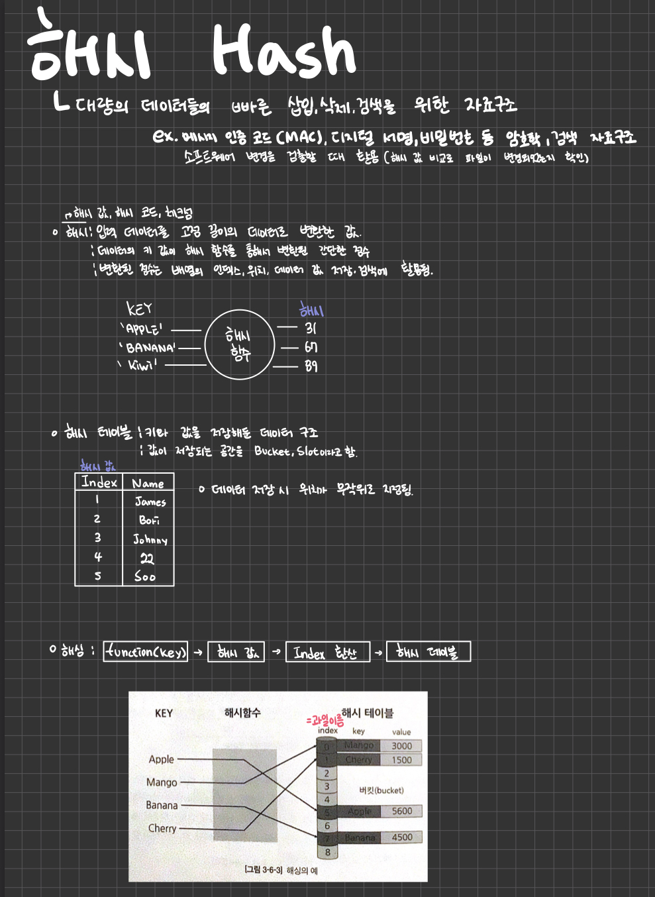

# TIL

Date: 2024년 3월 7일
Topic: TIL
Tags: Data Structure, 독서

1. 독서) 개발자가 되기 위해 꼭 알아야 하는 IT 용어
   - Part1. 웹/디자인
     - Terms 10. CSR/SSR
     - Terms 11. 캐시/쿠키/세션
   - VSCODE / IT.md 파일
2. 독서) 나는 네이버 프런트엔드 개발자입니다.
   - 캡틴판교, 장기효님 프런트엔드 개발상담 무엇이든 물어보세요
   - frontend roadmap
     [Frontend Developer Roadmap: What is Frontend Development?](https://roadmap.sh/frontend)
3. Data Structure
   - Hash 개념 공부하기
     
