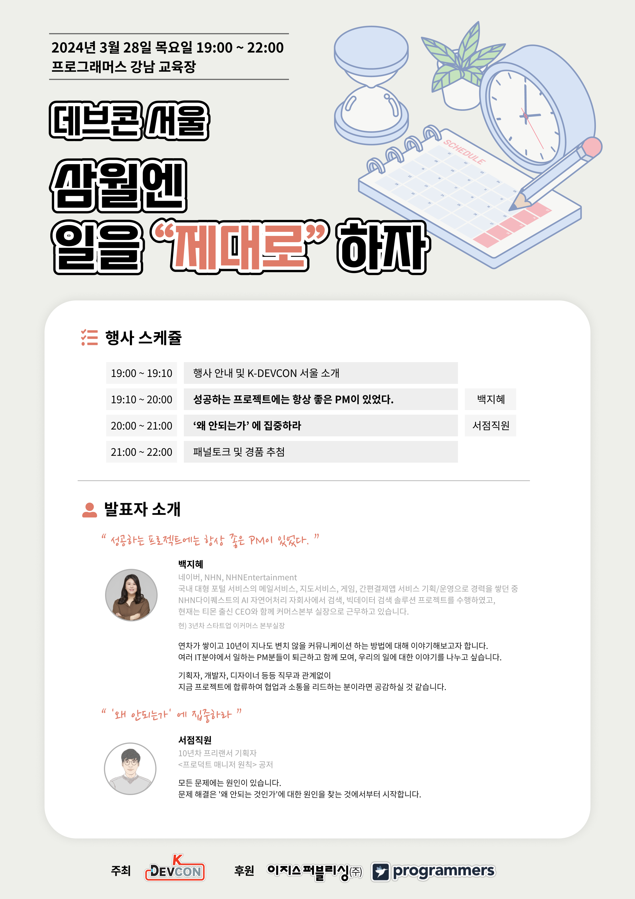

# TIL

Date: 2024년 3월 28일
Topic: TIL
Tags: Jenkins, 강의, 세미나, 프로그래머스

1. Jenkins

   - 사용자 관리하기 (User)

 

2. 데브콘 3월 서울 : 삼월엔 일을 '제대로' 하자

# 행사 일정

- 19:00 ~ 19:10 : 행사 안내 및 K-DEVCON 서울 소개
- 19:10 ~ 20:00 : 성공하는 프로젝트에는 항상 좋은 PM이 있었다. - 백지혜
- 20:00 ~ 21:00 : '왜 안되는가'에 집중하라 - 서점직원
- 21:00 ~ 22:00 : 패널토크 및 경품 추첨
