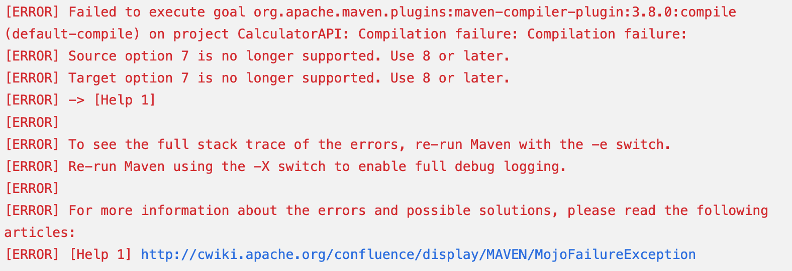

# TIL

Date: 2024년 4월 9일
Topic: TIL

1. Jenkins

   - 오류 고치기
       

   - pom.xml에서 버전 지정하기
     
   - 14장 공부하기 : 파이프라인 이해하기

2. 알고리즘 코테 스터디
   - 내일 문제를 풀지 못할 것 같아서 미리 문제 풀기! → 업로드는 내일하기
     [2615번: 오목](https://www.acmicpc.net/problem/2615)

### 2024년 4월 9일 화요일

---

💜 어제자 피드백

- 어제는 밤을 새지 않고 오전 출근을 하였기에, 분명히 오후 5시에 퇴근 후 컨디션이 괜찮을 줄 알았는데 밤을 샌 날보다 몸 상태가 더 좋지 않았다.. 심지어 교대하시는 분이 늦게 오셔서 집에 늦게 들어갔는데 가자마자 기절하고 오후 출근을 위해 눈을 뜨니 머리가 넘 아팠다ㅠㅠ 그래도 해야 할 일들은 다 해서 다행이다…!

💜 일(취준), 건강, 휴식

- 충분히 자기 → 무려 15시간 잔 거 실환가..?
- Jenkins 13장 최종 마무리 && Jenkins 오류 고치기..
- Jenkins 14장 : 파이프라인 이해하기
