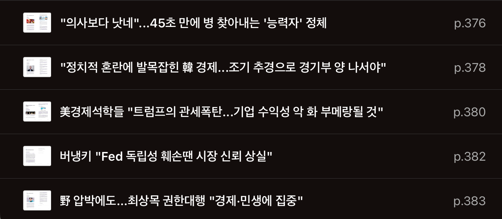

# TIL

Date: 2025년 1월 6일
Topic: TIL
Tags: Javascript, React, Udemy, notion, 경제신문스크랩, 딥다이브스터디, 사이드프로젝트

## 1월 1주차 목표 (1/6 ~ 1/12)

**[모던 JS 딥다이브]**

- [x] ~~(15주차) 41장 ~ 42장 공부~~
- [ ] (15주차) 41장 ~ 42장 발표
- [ ] (16주차) 43장 공부

**[코테합 JS]**

- 백트래킹 프로그래머스 문제 풀이
  - [ ] 87946 : 피로도
  - [ ] 12952 : N-퀸
  - [ ] 92342 : 양궁대회
  - [ ] 60062 : 외벽 점검
  - [ ] 92345 : 사라지는 발판

**[React]**

- Udemy
  - [x] ~~14강(1H) : 클래스 컴포넌트~~
  - [x] ~~15강(1H 30M) : HTTP 요청 보내기 (DB 연결)~~
  - [ ] 16강(40M) : 커스텀 리액트 Hook
  - [ ] 17강(2H) : 사용자 입력 작업
  - [ ] 18강(3H) : 음식 주문 앱 구축하기
  - [ ] 25강(7H) : Next.js

**[사이드 프로젝트]**

- ~~노션 : 레이아웃 수정 및 멤버 권한 부여~~
- FE
  - 라이브러리 정하기 (전역 상태 / react-query 사용 여부 / 에디터 라이브러리)
  - 프로젝트 전역 관련 초기 세팅

## 2025년 1월 6일 월요일

---

- [모던 JS 딥다이브]

  - 41장. 타이머 : SetTimeout, SetInerval + 디바운스/스로틀

- [React] Udemy

  - 14강. 클래스 컴포넌트

    - 클래스 컴포넌트에서 생명주기 메서드 사용해보기
      ```
      componentDidMount == useEffect(...,[])
      componentDidUpdate == useEffect(...,[someValue])
      componentWillUnmount == useEffect(()=>{return ()=>{cleanup}},[])
      ```
    - 클래스 컴포넌트를 사용해야만 하는 경우 : **오류 경계** (componentDidCatch)

      ```jsx
      import { Component } from 'react'
      class ErrorBoundary extends Component {
        // 오류 경계를 사용하려면 componentDidCatch() 메서드를 구현해야 함 -> class 컴포넌트에서만 사용 가능
        constructor() {
          super()
          this.state = { hasError: false }
        }
        componentDidCatch(error) {
          console.log(error)
          this.setState({ hasError: true })
        }

        render() {
          if (this.state.hasError) {
            return <p>Something went wrong!</p>
          }
          return this.props.children
        }
      }

      export default ErrorBoundary
      ```

  - 15강. HTTP 요청
    - fetch 함수 사용과 useEffect 사용, 낙관적 업데이트를 중심으로

- [사이드 프로젝트]

  - 라이브러리 검색 및 정리

    - 전역관리
      ## 후보
      1. Context : React 내장 기능
      2. Redux : 보일러플레이트 문제? → Zustand 대체 많아짐 (복잡하고 큰 애플리케이션) (764KB)
      3. Zustand : 간결하고 좋은 성능 (86.5KB)
      4. Recoil : Atom, Selector 개념 사용 → 효율적인 상태 관리 (대규모, 비동기 많을 때)
      5. Jotai : Recoil에서 영감, Atom 개념 중심 동작 → 보다 더 직관적인 사용 가능 (소규모, 간단할 때)
      ## 선택 기준
      - 프로젝트 상태 관리의 복잡도
        - 소규모 : Zustand, Jotai, Context
        - 대규모 : Redux, Recoil
      - 라이브러리의 러닝 커브
        - 높음
          - Redux(보일러플레이트 → Redux Toolkit 사용)
        - 중간
          - Recoil : Atom, Selector 개념 학습
        - 낮음
          - Zustand / Jotai : 직관적인 사용 가능, 빠른 개발 가능
      - 성능/리렌더링 최적화
        - 성능 최적화 중요
          - Zustand(불필요한 리렌더링 방지)
          - Redux, Recoil
      - 디버깅 및 개발자 도구
        - Redux : Redux DevTools → 상태변경추적, 시간여행디버깅
        - Zustand : Redux DevTools 통합 사용 가능
      - 사용량, 커뮤니티 지원, 접근성 등
        - Redux : 오랜 역사인만큼 볼 수 있는 문서나 커뮤니티 지원이 풍부함
        - Zustand, Jotai : 상대적으로 작은 커뮤니티, 성장 중인 라이브러리
        - Recoil : 대규모 프로젝트에서는 한계가 있을 정도의 부족한 자료
      - 비동기 작업 처리
        - Redux : Redux Thunk, Redux Saga 등의 미들웨어
        - Recoil : Selector로 비동기 상태 관리
        - Zustand, Jotai : 비동기 상태 관리를 지원하지만 상대적으로 단순한 구현 방식 제공
    - 에디터

      ### 후보

      1. `React-Quill` : 설치/사용 간단, 다양한 테마와 모듈로 커스터마이징
      2. `React-Draft-Wysiwyg` : Draft.js + WYSIWYG 에디터, 다양한 포맷팅 옵션/플러그인 시스템
      3. `Toast UI Editor` : NHN 개발 (마크다운 + WYSIWYG), 다국어 지원
      4. `Draft.js` : Facebook 개발, 상태 관리 및 포맷팅에 유용
      5. `react-md-editor`: 재성님 특별 추천 (typescript)

      ## 선정기준

      - 러닝커브 (+ 설치방법)
        - 높음 : `React-Draft-Wysiwyg` (설치 과정 복잡), `Draft.js`(설정 복잡)
        - 중간 : `Toast UI Editor` (깔끔한 UI, 다양한 툴바 옵션)
        - 낮음 : `React-Quill`
      - 파일 크기
        - 무거움 : `Toast UI Editor`
        - 가벼움 : `React-Quill`
      - 마크다운 지원

        - 지원 X : `React-Quill`, `React-Draft-Wysiwyg`(별도의 플러그인, 변환 라이브러리 사용가능), `Draft.js`
        - 지원 : `Toast UI Editor`, `react-md-editor`

      - 제한된 기능
        1. `React-Quill` : 이미지가 base64로 저장됨
        2. `React-Draft-Wysiwyg` : 한글 입력 시 이슈 우려
        3. `Toast UI Editor` : React 18와의 호환성 문제
        4. `Draft.js` : 복잡한 설정

- [경제신문 스크랩]
  
