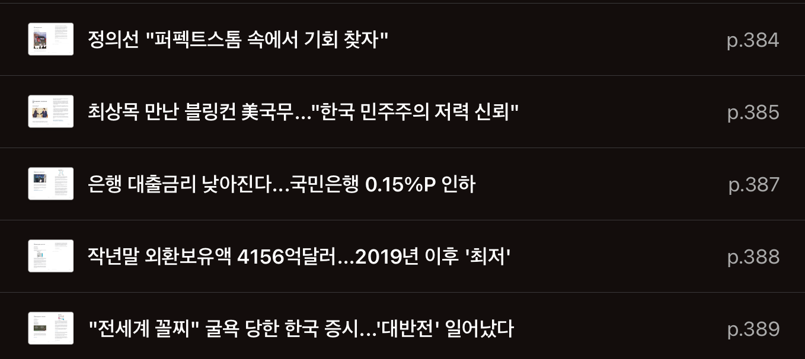

# TIL

Date: 2025년 1월 7일
Topic: TIL

## 1월 1주차 목표 (1/6 ~ 1/12)

**[모던 JS 딥다이브]**

- [x] ~~(15주차) 41장 ~ 42장 공부~~
- [ ] (16주차) 43장 공부

**[코테합 JS]**

- 백트래킹 프로그래머스 문제 풀이
  - [ ] 87946 : 피로도
  - [ ] 12952 : N-퀸
  - [ ] 92342 : 양궁대회
  - [ ] 60062 : 외벽 점검
  - [ ] 92345 : 사라지는 발판

**[React]**

- Udemy
  - [x] ~~14강(1H) : 클래스 컴포넌트~~
  - [x] ~~15강(1H 30M) : HTTP 요청 보내기 (DB 연결)~~
  - [x] 16강(40M) : 커스텀 리액트 Hook
  - [ ] 25강(7H) : Next.js

**[사이드 프로젝트]**

- ~~노션 : 레이아웃 수정 및 멤버 권한 부여~~
- ~~FE : 라이브러리 정하기 (전역 상태 / react-query 사용 여부 / 에디터 라이브러리)~~

## 2025년 1월 7일 화요일

---

- [React] Udemy

  - 16강 : 커스텀 리액트 Hook
  - 25강 : Next.js(7H)

- [사이드 프로젝트]

  - FE 회의
    - 라이브러리 선정
      - 전역 상태 관리 라이브러리 : Zustand 사용
      - React Query : 러닝커브 이슈로 사용 x
      - 텍스트 에디터 라이브러리 : React-Quill
    - 협업 컨벤션 정하기
      - ESLint
      - Pull Request
      - Commit

- [경제신문스크랩]
  
