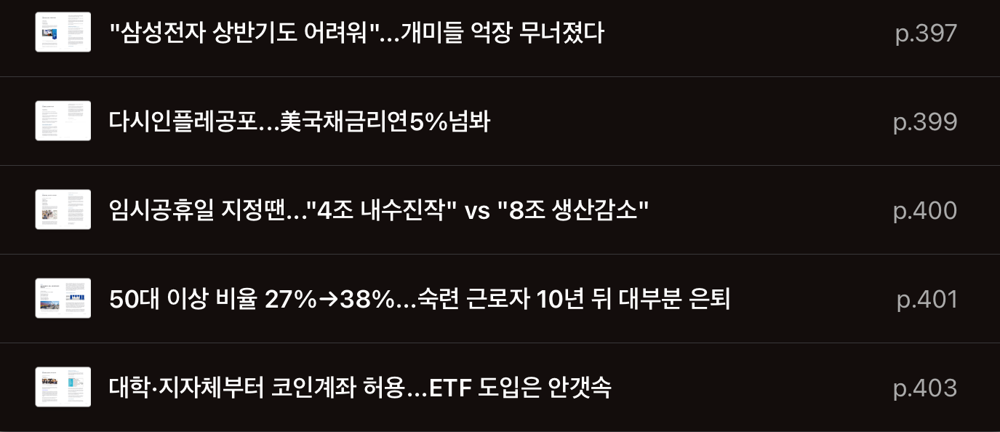

# TIL

Date: 2025년 1월 9일
Topic: TIL
Tags: Algorithm, Next, Udemy, 백트래킹알고리즘, 코테스터디

## 1월 1주차 목표 (1/6 ~ 1/12)

**[모던 JS 딥다이브]**

- [x]  ~~(15주차) 41장 ~ 42장 공부~~
- [ ]  (16주차) 43장 공부

**[코테합 JS]**

- 백트래킹 프로그래머스 문제 풀이
    - [x]  87946 : 피로도
    - [x]  12952 : N-퀸
    - [ ]  92342 : 양궁대회

**[React]**

- Udemy
    - [x]  ~~14강(1H) : 클래스 컴포넌트~~
    - [x]  ~~15강(1H 30M) : HTTP 요청 보내기 (DB 연결)~~
    - [x]  16강(40M) : 커스텀 리액트 Hook
    - [ ]  25강(7H) : Next.js

**[사이드 프로젝트]**

- ~~노션 : 레이아웃 수정 및 멤버 권한 부여~~
- ~~FE : 라이브러리 정하기 (전역 상태 / react-query 사용 여부 / 에디터 라이브러리)~~

## 2025년 1월 9일 목요일

---

- [코테합 JS]
    - 87946 : 피로도 (완료)
    - 12952 : N-퀸 (완료)
    - 92342 : 양궁대회 (풀이 중..)
    
- [React] Udemy
    - 25강(7H) : Next.js

- [경제신문스크랩]
    
    
