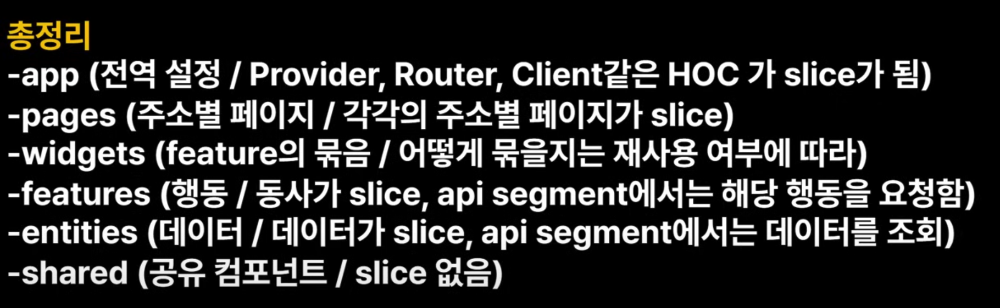

# TIL

Date: 2025년 1월 14일
Topic: TIL

## 1월 3주차 목표 (1/13 ~ 1/19)

**[모던 JS 딥다이브]**

- [x]  (15주차) 40장 ~ 41장 스터디
- [x]  (16주차) 42장 ~ 44장 스터디

**[코테합 JS]**

- 정렬 개념 정리하기
    - [ ]  삽입 정렬
    - [ ]  병합 정렬
    - [ ]  힙 정렬

**[React]**

- Udemy
    - [ ]  25강(7H) : Next.js
- 클린 코드 참고 문서

**[사이드 프로젝트]**

- FE : 폴더 구조, 업무 분할, 에디터 라이브러리 선택
    - (BE + FE) : Git 컨벤션 정리, 기능 정리

## 2025년 1월 14일 화요일

---

- [모던 JS 딥다이브]
    - 16주차 스터디 자료 만들기
    - pm 09, 15주차 & 16주차 스터디

- [사이드 프로젝트]
    - pm 06, FE&BE 기능회의
    - [FE] 폴더 구조 FSD 공부해보기
        
        
        
    - [FE] 에디터 라이브러리 사용해보고 비교하기
