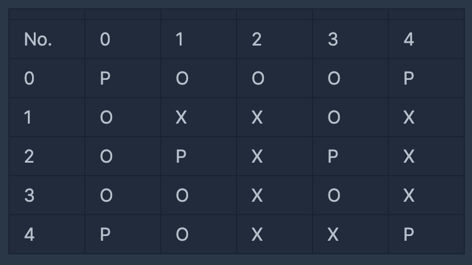

# - 문제 풀이 아이디어

## 1. BFS로 풀기? (상,하,좌,우 이동)

> dx = [-1, 1, 0, 0]
> dy = [0, 0, -1, 1]

**조건 1**) 지원자들끼리의(1-2345, 2-3`45, 3-45, 4-5) 맨해튼 거리가 3 이상인지,
**조건 2**) 지원자들끼리의 사이에 파티션(X)으로 막혀있는지
<br>

0,0부터 상하좌우로 이동하면서 P를 발견하면 if문으로 거리두기 확인(isSeparate)하기
<br>

!isSeparate라면, 거리두기가 지켜지지 않았으므로 answer에 0 담고 다음 place 배열로 이동하기.
(if(거리두기확인용 구현문) -> isSeparate == false )

```javascript
if (!isSeparate) {
  answer.push(0)
  continue // 다음 대기실 확인하기
}`
```

<br>

<hr>

## 2. 모든 지원자들의 위치를 미리 저장해놓기?

## - 거리두기확인용 구현문은 어떻게 작성하면 좋을까?

> 조건 1) 맨해튼 거리 2 이하 Math.abs(X1 - X2) + Math.abs(Y1 - Y2) <= 2 일때
> 조건 2) 파티션 없으면 return 0

### 대기실 형태 : ['POOOP', 'OXXOX', 'OPXPX', 'OOXOX', 'POXXP']



- 모든 지원자들의 위치 저장해놓기?
  ```javascript
  // prettier-ignore
  PersonArr = [[0, 0], [0, 4], [2, 1], [2, 3], [4, 0], [4, 4]]
  ```


