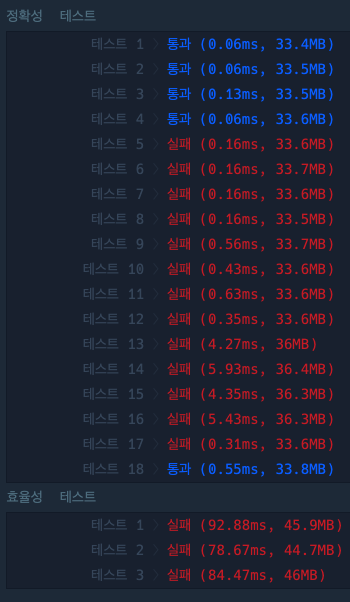
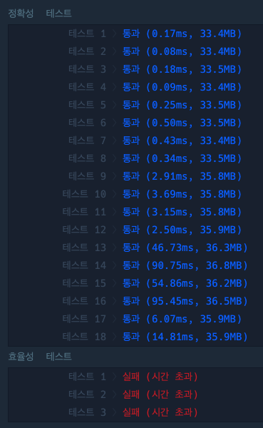

## 첫 번째 풀이. 서로 내림차순으로 정렬하여 greedy로 풀기

```javascript
function solution(A, B) {
  B.sort((a, b) => b - a)

  return A.sort((a, b) => b - a).reduce((score, numA, i) => {
    if (B[i] > numA) score++
    return score
  }, 0)
}
```



## 두 번째 풀이.

- A팀은 그대로 두고, B팀 중에서 가장 작은 차이로 큰 수를 찾아내기.
- sort문 => O(NlogN)
- reduce, for문 사용 => O(N²)
- ∴ O(NlogN) + O(N²) = O(N²)

```javascript
function solution(A, B) {
  B.sort((a, b) => b - a)

  return A.reduce((count, numA, i) => {
    const maxArr = [Infinity, 0]
    for (let j = 0; j < B.length; j++) {
      if (B[j] > numA && maxArr[0] > B[j]) {
        maxArr[0] = B[j] // 큰 수 저장
        maxArr[1] = j // 인덱스 저장
      }
    }
    if (maxArr[0] !== Infinity) {
      B[maxArr[1]] = -1
      count++
    }

    return count
  }, 0)
}
```



## 세 번째 풀이

- 시간복잡도 개선! O(N²)을 줄여야함 => 이중반복문을 반복문 1번으로 줄이기
- 이진탐색이나, sort를 적극적으로 활용하기!

```javascript
function solution(A, B) {
  A.sort((a, b) => a - b) // A 다시 sort하기
  B.sort((a, b) => a - b)

  let score = 0
  let j = 0

  for (let i = 0; i < B.length; i++) {
    if (B[i] > A[j]) {
      score++
      j++
    }
  }

  return score
}
```
