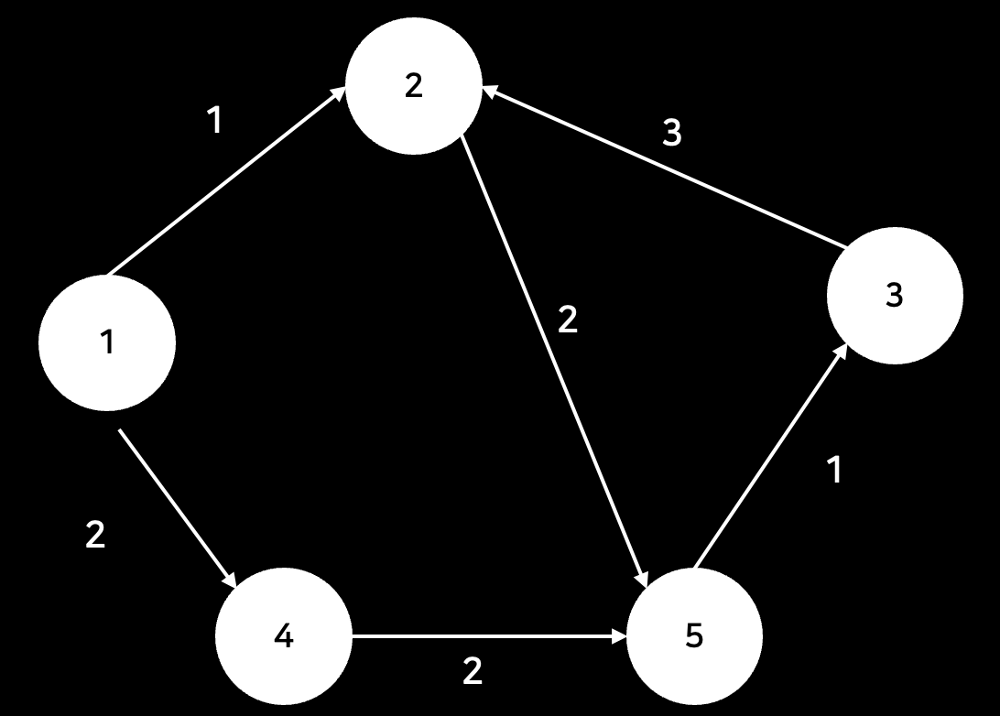
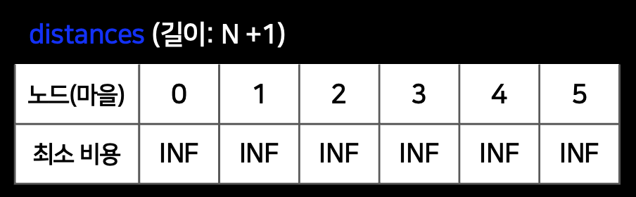
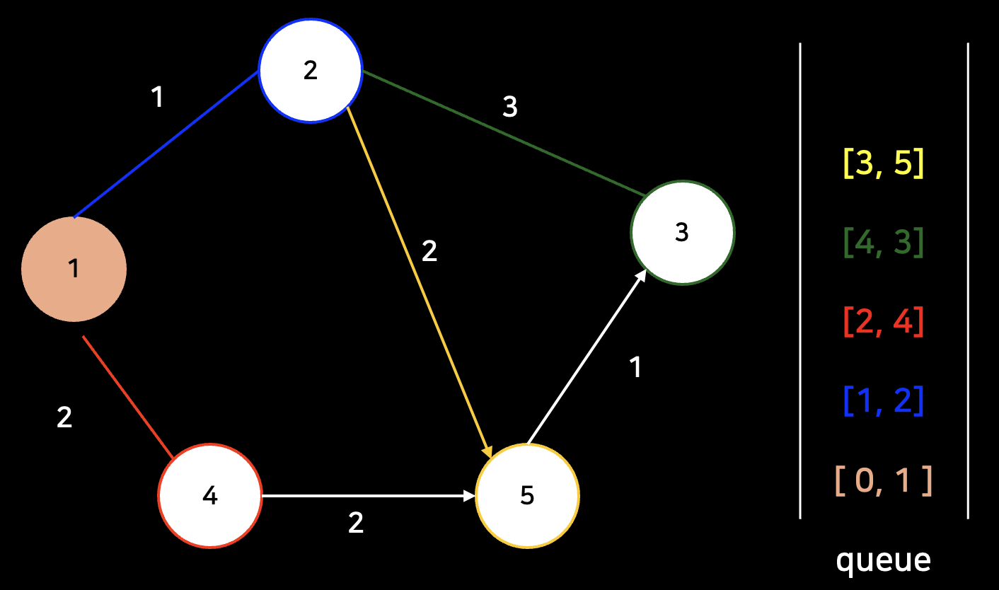
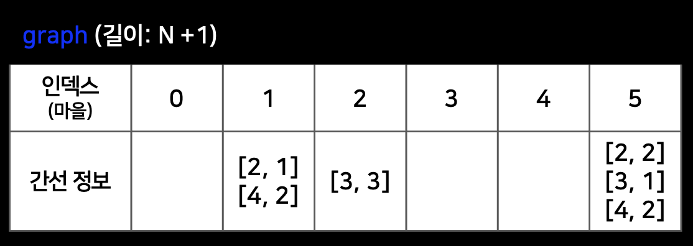

## 그래프 형태

---

## 사용한 변수

1. **distances** : 각 노드(마을)의 최소 거리를 저장하는 배열
   

   1. 초기값 : `Infinity`
   2. 초기 설정 : 1번 마을은 최소 거리를 0으로 설정 => `distances[1]  = 0`
      
       

2. **queue** : 방문용 배열
   
    

3. **graph** : 입력값 road를 배열로 수정
   1. node1 -> node2의 가중치(weight)만 저장
      
   2. node2 -> node1의 가중치(weight)도 저장
      

---
