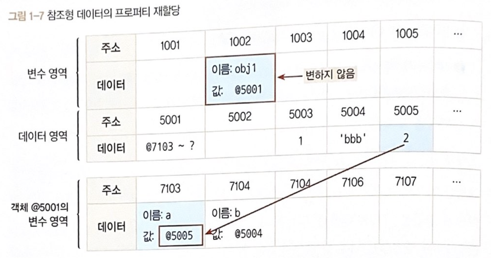

`모든 출처는 코어 자바스크립트에 있습니다.`

# CH 01. 데이터 타입

## 1-1. 데이터 타입의 종류

### 1-1-1. 데이터 타입의 종류
- **기본형**(원시형, primitive type) : `숫자(number)`, `문자열(string)`, `불리언(boolean)`, `null`,`undefined` + `심볼(Symbol) - (ES6 추가)`
  - 할당/연산시 복제
  - 값이 담긴 `주솟값`을 바로 복제
  - 불변성(immutablilty)을 띔


- **참조형**(reference type) : `객체(object)`, `배열(Array)`,`함수(Function)`,`날짜(Date)`,`정규표현식(RegExp)` + `Map, WeakMap, Set, WeakSet - (ES6 추가)`
  - 할당/연산시 참조 -> 복제임
  - 값이 담긴 주솟값들로 이뤄진 `묶음을 가리키는 주솟값`을 복제


## 1-2. 데이터 타입에 관한 배경지식
### 1-2-1. 메모리와 데이터
- 비트 : 0/1만 표현할 수 있는 하나의 메모리 조각
- 바이트 : 여러개의 비트를 한 단위로 묶음 (1byte = 8bit)
- C/C++ , JAVA (정적 타입 언어) : 메모리 낭비를 최소화하기 위해 데이터 타입별로 할당할 메모리 영역을 2byte, 4byte 등으로 나눔
- Javascript : 메모리 용량이 월등히 커짐, 숫자의 경우 정수형/부동소수형 구분 없이 8byte(64bit) 확보 
  - 메모리 주솟값(memory address)을 통해 서로 구분/연결 가능


### 1-2-2. 식별자와 변수

- 변수(variable) : 변할 수 있는 데이터 (숫자,문자열,객체,배열)
- 식별자 : 데이터를 식별하는데 사용하는 이름, 즉 변수명


## 1-3. 변수 선언과 데이터 할당
### 1-3-1. 변수 선언
`var a;` : 변할 수 있는 데이터를 만든다. 이 데이터의 식별자는 a로 한다. (초기화안하면 undefined)

### 1-3-2. 데이터 할당

```javascript
var a; // 변수 a 선언
a = 'abc'; // 변수 a에 데이터 할당

var a = 'abc'; // 변수 선언과 할당을 한 문장으로 표현
```

- a라는 이름을 가진 주소를 검색해서 그곳에 문자열 'abc' 할당 ? ❌


- 실제 데이터 할당에 대한 메모리 영역
  - 1. 변수 영역에서 빈 공간(@1003)을 확보
    2. 확보한 공간의 식별자를 a로 지정
    3. 데이터 영역의 빈 공간(@5004)에 문자열 'abc' 저장
    4. 변수 영역에서 a라는 식별자 검색(@1003)
    5. 앞서 저장한 문자열의 주소(@5004)를 @1003의 공간에 대입


- 이유) 데이터 변환을 자유롭게 할 수 있게 함과 동시에 메모리를 더욱 효율적으로 관리하기 위해서


- 문자열 변환에 대한 메모리 영역의 변화
  - 'abc'마지막에 'def'를 추가하라고 하면,
  - 컴퓨터는 앞서 'abc'가 저장된 공간에 'abcdef'를 할당하는 대신
  - 'abcdef' 문자열을 새로 만들어 별도의 공간에 저장
  - 그 주소를 변수 공간에 연결


## 1-4. 기본형 데이터와 참조형 데이터
### 1-4-1. 불변값
- 변수(variable)/상수(constant)를 구분하는 성질 : '변경 가능성'
  - 변수 : 바꿀 수 있음
  - 상수 : 바꿀 수 없음

- 변수와 상수를 구분 짓는 변경 가능성의 대상은 **변수 영역** 메모리
  - 한 번 데이터 할당이 이뤄진 변수 공간에 다른 데이터를 재할당할 수 있는지 여부

- 불변성 여부를 구분할 떄의 변경 가능성의 대상은 **데이터 영역** 메모리
  - 기본형 데이터인 숫자,문자열,boolean,null,undefined,Symbol 모두 **불변값**


#### 1. 불변성의 개념 예시 (숫자/문자열)

```javascript
var a = 'abc';
a = a + 'def'; // 기존 'abc'가 변하는 것이 아니라 새로운 문자열 'abcdef'를 만들어 그 주소를 변수 a에 저장

var b = 5; // 컴퓨터는 데이터 영역에서 5를 찾고, 없으면 그제서야 데이터 공간을 하나 만들어 저장, 그 주소를 변수 b에 저장
var c = 5; // 컴퓨터는 데이터 영역에서 5를 찾고, 이미 만들어놓은 값이 있으니 주소 재활용
b = 7; // 기존 5 자체를 7로 바꾸는 것이 아니라 기존에 저장했던 7을 찾아서 있으면 재활용, 없으면 새로 만들어서 그 주소를 변수 b에 저장
```

- 결국 5와 7 모두 다른 값으로 변경할 수 없음


### 1-4-2. 가변값

#### 1. 참조형 데이터의 할당

```javascript
var obj1 = {
  a: 1,
  b: 'bbb'
};
```


1. 컴퓨터는 우선 변수 영역의 빈 공간(@1002)을 확보하고, 그 주소의 이름을 obj1으로 지정

2. 임의의 데이터 저장 공간(@5001)에 데이터를 저장하려고 보니 여러 개의 프로퍼티로 이뤄진 데이터 그룹임. 

   이 그룹 내부의 프로퍼티들을 저장하기 위해 별도의 변수 영역을 마련하고, 그 영역의 주소(@7103 ~ ?)를 @5001에 저장

3. @7103 및 @7104에 각각 a와 b라는 프로퍼티 이름 지정

4. 데이터 영역에서 숫자 1 검색. 검색 결과가 없으므로 임의로 @5003에 저장하고, 이 주소를 @7103에 저장

   문자열 'bbb' 역시 임의로 @5004에 저장하고, 이 주소를 @7104에 저장


- 기본형 데이터와의 차이) '객체의 변수(프로퍼티) 영역'이 별도로 존재

- 객체가 별도로 할애한 영역은 변수 영역일 뿐 '데이터 영역'은 기존의 메모리 공간 그대로 활용

  데이터 영역에 저장된 값은 모두 불변값

  그러나 변수에는 다른 값을 얼마든지 대입할 수 있음

- 따라서 참조형 데이터는 불변하지 않다(가변값이다)


#### 2. 가변성의 개념 예시

```javascript
var obj1 = {
  a:1,
  b: 'bbb'
};

obj1.a = 2; // obj1의 a 프로퍼티에 숫자 2 할당 -> 데이터 영역에서 숫자 2 검색 -> 검색 결과 없으므로 빈 공간인 @5005에 저장하고,           
            // 이 주소를 @7103에 저장
```

- 변수 obj1이 바라보고 있는 주소는 @5001로 변하지 않았음

  즉 '새로운 객체'가 만들어진 것이 아니라 기존의 객체 내부의 값만 바뀐 것

  

#### 3. 중첩 객체(nested object)

- 참조형 데이터의 프로퍼티에 다시 참조형 데이터를 할당하는 경우

  ```javascript
  var obj = {
    x:3,
    arr: [3,4,5]
  };
  ```

  1. 컴퓨터는 우선 변수 영역의 빈 공간(@1002)를 확보하고, 그 주소의 이름을 obj로 지정

  2. 임의의 데이터 저장공간(@5001)에 데이터를 저장하려는데, 이 데이터는 여러 개의 변수와 값들을 모아놓은 그룹(객체)임

     이 그룹의 각 변수(프로퍼티)들을 저장하기 위해 별도의 변수 영역을 마련하고(@7103 ~ ?), 그 영역의 주소를 @5001에 저장

  3. @7103에 이름 x를, @7104에 이름 arr를 지정

  4. 데이터 영역에서 숫자 3을 검색. 없으므로 임의로 @5002에 저장하고, 이 주소를 @7103에 저장함

  5. @7104에 저장할 값은 배열로서 역시 데이터 그룹임

     이 그룹 내부의 프로퍼티들을 저장하기 위해 별도의 변수 영역을 마련하고(@8104 ~ ?), 그 영역의 주소 정보(@8104~?)를 @5003에 저장

     @5003을 @7104에 저장

  6. 배열의 요소가 총 3개이므로 3개의 변수 공간을 확보하고 각각 인덱스 부여 (0,1,2)

  7. 데이터 영역에서 숫자 3을 검색해서(@5002)그 주소를 @8104에 저장

  8. 데이터 영역에서 숫자 4가 없으므로 @5004에 저장하고, 그 주소를 @8105에 저장

  9. 데이터 영역에서 숫자 5가 없으므로 @5005에 저장하고, 그 주소를 @8106에 저장

  

- obj.arr[1] 검색 -> `@1002 -> @5001 -> (@7103 ~ ?) -> @7104 -> @5003 - (@8104 ~ ?) -> @8105 -> @5004 -> 4 반환` 

- 재할당 명령을 내린다면? `obj.arr = 'str';`

  1. @5006에 문자열 'str' 저장하고, 그 주소를 @7104에 저장

  2. @5003은 더이상 자신을 참조하는 변수가 하나도 없게 됨 

     @5003의 `참조카운트`는 @7104에 @5003이 저장돼 있던 시점까지는 1이었지만,

     @7104에 @5006이 저장되는 순간 0이 됨

     `참조카운트` : 어떤 데이터에 대해 자신의 주소를 참조하는 변수의 개수

  3. 참조카운트가 0인 메모리 주소는 `가비지 컬렉터(garbage collector,GC)`의 수거 대상

     `가비지 컬렉터` : 런타임 환경에 따라 특정 시점이나 메모리 사용량이 포화 상태에 임박할 때마다 자동으로 수거 대상들을 수거(collecting)함

     ​						수거된 메모리는 다시 새로운 값을 할당할 수 있는 빈 공간이 됨

  4. @5003은 참조 카운트가 0이 됨에 따라 GC 대상이 되고, 이후 언젠가 담겨 있던 데이터인 '@8104~?'라는 값이 사라짐

     이 과정에서 연쇄적으로 @8104 ~ ?의 각 데이터들의 참조카운트가 0이 되고, 이들 역시 GC의 대상이 되어 함께 사라질 것임
  
  


### 1-4-3. 변수 복사 비교

#### 1. 변수를 복사할 때의 변화

```javascript
// 기본형 데이터
var a = 10;
var b = a;

// 참조형 데이터
var obj1 = {c:10, d:'ddd'};
var obj2 = obj1;
```


- 기본형 데이터
  - 변수 선언 및 할당	
    - 변수 영역의 @1001을 확보하고 식별자를 a로 지정
    - 숫자 10을 데이터 영역에서 검색하고 없으므로 빈 공간 @5001에 저장한 다음, 이 주소를 @1001에 넣음
  - 복사
    - 변수 영역의 빈 공간 @1002을 확보하고 식별자를 b로 지정
    - 식별자 a를 검색해 그 값을 찾아옴. @1001에 저장된 값인 @5001을 들고 좀 전에 확보해둔 @1002에 값으로 대입


- 참조형 데이터
  - 변수 선언 및 할당
    - 변수 영역의 @1003을 확보하고 식별자를 obj1로 지정
    - 데이터 영역의 빈 공간 @5002을 확보하고, 데이터 그룹이 담겨야 하기 때문에 별도의 변수 영역 @7103~?을 확보해 그 주소를 저장
    - @7103에는 식별자 c, @7104에는 식별자 d를 입력한 다음, c에 대입할 값 10를 데이터 영역에서 검색
    - @5001에 이미 저장돼 있으므로 이 주소를 @7103에 연결하고,
    - 문자열인 'ddd'는 데이터 영역의 빈 공간에 새로 만들어서 @7104에 연결
  - 복사
    - 변수 영역의 빈공간 @1004를 확보하고 식별자를 obj2로 지정
    - 식별자 obj1를 검색해 (@1003) 그 값인 @5002을 들고 @1004에 값으로 대입


#### 2. 변수 복사 이후 값 변경 결과 비교 (1) - 객체의 프로퍼티 변경시

```javascript
var a = 10;
var b = a;
var obj1 = { c:10, d:'ddd'};
var obj2 = obj1;

b = 15; // 새로운 공간 @5004에 저장하고 그 주소를 든 채로 변수 영역에서 식별자가 b인 주소를 찾음. @1002의 값 = @5004
obj2.c = 20; // 새로운 공간 @5005에 저장하고, 그 주소를 든 채로 변수 영역에서 obj2를 찾고(@1004), 
             // obj2의 값인 @5002가 가리키는 변수 영역에서 다시 c를 찾아(@7103) 그곳에 @5005 대입
```


```javascript
a !== b //b의 값이 @1002로 달라짐 -> 서로 다른 주소를 바라봄
obj1 === obj2 // @1004의 값이 달라지지 않음 -> 같은 객체를 바라봄
```


#### 3. 변수 복사 이후 값 변경 결과 비교 (2) - 객체 자체를 변경했을 때

```javascript
var a = 10;
var b = a;
var obj1 = {c:10, d:'ddd'};
var obj2 = obj1;

b = 15;
obj2 = {c:20,d:'ddd'}
```


```javascript
a !== b
obj1 !== obj2
```

- 참조형 데이터가 '가변값'이라고 설명할 때의 '가변'은 참조형 데이터 자체를 변경할 경우가 아니라 그 내부의 프로퍼티를 변경할 때만 성립


## 1-5. 불변 객체(immutable object)

### 1-5-1. 불변 객체를 만드는 간단한 방법

- 데이터 자체를 변경하고자 하면(새로운 데이터를 할당하고자 하면) 기본형 데이터와 마찬가지로 **기존 데이터는 변하지 않음**

- 그렇다면 내부 프로퍼티를 변경할 필요가 있을 때마다 매번 새로운 객체를 만들어 재할당하기로 규칙을 정하거나 

  자동으로 새로운 객체를 만드는 도구를 활용한다면 객체 역시 **불변성을 확보할 수 있음**


- 불변 객체가 필요한 상황

  - 값으로 전달받은 객체에 변경을 가하더라도 원본 객체는 변하지 않아야 하는 경우

  - **객체의 가변성에 따른 문제점**
    
    ```javascript
    var uesr = {
      name: 'Jaenam',
      gender : 'male'
    };
    
    var changeName = function(user, newName){
      var newUser = user; // 복사를 통해 서로 같은 곳을 지정
      newUser.name = newNmae;
      return newUser;
    };
    
    var user2 = changeName(user, 'Jung');
    
    if (user !== user2){
      console.log('유저 정보가 변경되었습니다.');
    }
    
    console.log(user.name, user2.name); //Jung Jung
    console.log(user === user2); //true
    ```
  
  
  
  
  
  - **객체의 가변성에 따른 문제점의 해결 방법**
  
    ```javascript
    var uesr = {
      name: 'Jaenam',
      gender : 'male'
    };
    
    var changeName = function(user, newName){
      return { // 복사가 아닌 서로 다른 객체 생성
        name : newName,
        gender: user.gender
      };
    };
    
    var user2 = changeName(user, 'Jung');
    
    if (user !== user2){
      console.log('유저 정보가 변경되었습니다.'); // 유저 정보가 변경되었습니다.
    };
    
    console.log(user.name, user2.name); //Jaenam Jung
    console.log(user === user2); //false
    ```
  
    - changeName함수가 새로운 객체를 반환하도록 수정
    - 이제 user와 user2는 서로 다른 객체이므로 안전하게 변경 전과 후를 비교할 수 있음
    - 하지만, 새로운 객체를 만들면서 변경할 필요가 없는 기존 객체의 프로퍼티를 하드코딩으로 입력
      - 대상 객체에 정보가 많을수록, 변경해야할 정보가 많을수록 사용자가 입력하는 수고가 늘어남
    - 따라서 대상 객체의 프로퍼티 개수에 상관없이 모든 프로퍼티를 복사하는 함수를 만드는 것이 좋음
  
  
  
  
  
  - **기존 정보를 복사해서 새로운 객체를 반환하는 함수(얕은 복사)**
  
    ```javascript
    var copyObject = function (target){
      var result = {};
      for (var prop in target){
        result[prop] = target[prop];
      }
      return result;
    };
    ```
  
    ```javascript
    // copyObject를 이용한 객체 복사
    var user = {
      name: 'Jaenam',
      gender: 'male'
    };
    
    var user2 = copyObject(user);
    user2.name = 'Jung';
    
    if (user !== user2){
      console.log('유저 정보가 변경되었습니다.'); // 유저 정보가 변경되었습니다.
    };
    
    console.log(user.name, user2.name); //Jaenam Jung
    console.log(user === user2); //false
    ```
  
    - user 객체 = 불변 객체
    - immutable.js | baobab.js등의 라이브러리 -> 불변성을 지닌 별도의 데이터 타입과 그에 따른 메서드 제공


### 1-5-2. 얕은 복사와 깊은 복사

- 얕은 복사(shallow copy) : 바로 아래 단계의 값만 복사하는 방법

  - 중첩된 객체에서 참조형 데이터가 저장된 프로퍼티를 복사할 때 `그 주솟값만` 복사

  - 해당 프로퍼티에 대해 원본과 사본이 모두 동일한 참조형 데이터의 주소를 가리킴 -> 사본을 바꾸면 원본도 바뀜 (반대도 성립)

  - **중첩된 객체에 대한 얕은 복사**

    ```javascript
    var user = {
      name : 'Jaenam',
      urls: {
        portfolio : 'http://github.com/abc',
        blog : 'http://blog.com',
        facebook: 'http://facebook.com/abc'
      }
    };
    
    var user2 = copyObject(user);
    
    user2.name = 'Jung';
    console.log(user.name === user2.name); //false
    
    user.urls.portfolio = 'http://portfolio.com';
    console.log(user.urls.portfolio === user2.urls.portfolio); //true
    
    user2.urls.blog = '';
    console.log(user.urls.blog === user2.urls.blog); //true
    ```

    

  

- 깊은 복사(deep copy) : 내부의 모든 값들을 하나하나 찾아서 전부 복사하는 방법

  - **중첩된 객체에 대한 깊은 복사**

    ```javascript
    var user2 = copyObject(user);
    user2.urls = copyObject(user.urls); // url 프로퍼티에 copyObject 함수를 실행한 결과를 할당
    																		// 내부까지 복사해서 새로운 데이터 생성 -> 아예 다른 객체 생성
    
    user.urls.portfolio = 'http://portfolio.com';
    console.log(user.urls.portfolio === user2.urls.portfolio); //false
    
    user2.urls.blog = '';
    console.log(user.urls.blog === user2.urls.blog); //false
    ```

    - **기본형 데이터 : 그대로 복사**
    - **참조형 데이터 : 다시 그 내부의 프로퍼티들을 복사**

  

  - **객체의 깊은 복사를 수행하는 범용 함수**

    ```javascript
    var copyObjectDepp = function(target){
      var result = {};
      if (typeof target === 'object' && target !== null){
        for (var prop in target){
          result[prop] = copyObjectDeep(target[prop]); // target이 객체라면 내부 프로퍼티를 순회하며 함수 재귀호출
        }
      }else { // target이 객체가 아니라면 target을 그대로 지정
        result = target; 
      }
      return result;
    };
    ```
  
    
  
  - **깊은 복사 결과 확인**
    ```javascript
    var obj = {
      a : 1,
      b : {
        c : null,
        d : [1,2]
      }
    };
    var obj2 = copyObjectDepp(obj);
    obj2.a = 3;
    obj2.b.c = 4;
    obj.b.d[1] = 3;
    
    console.log(obj); // { a : 1, b : { c:null, d:[1,3] } }
    console.log(obj2); // { a : 3, b : { c:4, d:[0:1,1:2] } }
    ```
  


## 1-6. undefined와 null

- '없음'을 나타내는 값 2가지

  - undefined : 사용자가 명시적으로 지정하거나 값이 존재하지 않을때 js 엔진이 자동으로 부여
    - 값을 대입하지 않은 변수, 즉 데이터 영역의 메모리 주소를 지정하지 않은 식별자에 접근할 때
    - 객체 내부의 존재하지 않는 프로퍼티에 접근하려고 할 때
    - return 문이 없거나 호출되지 않는 함수의 실행 결과 

  

  - null

    - 주의할 점 : `type of null` 이 `object`임

    ```javascript
    var n = null;
    console.log(typeof n); // object
    
    console.log(n == undefined); // true
    console.log(n == null); //true
    
    console.log(n === undefined); // false
    console.log(n === null); //true
    ```

    
