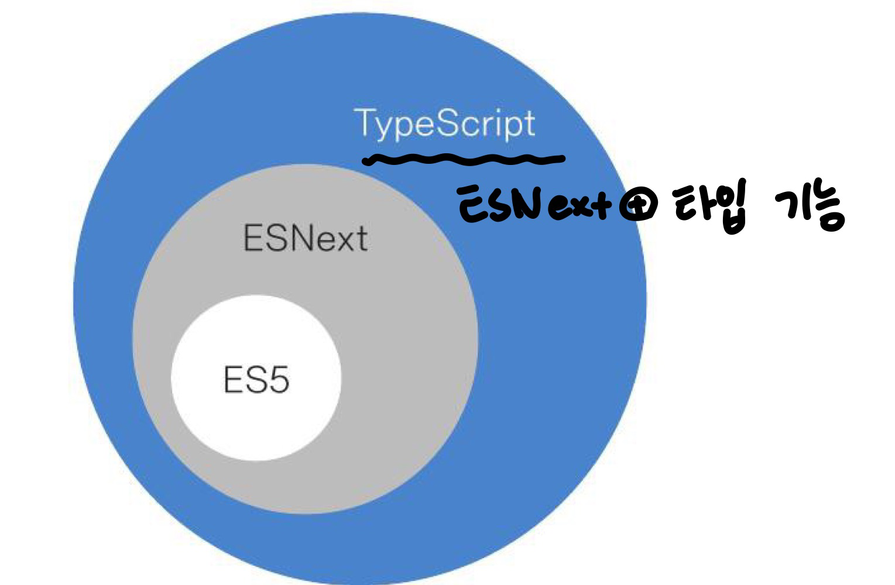

`모든 출처는 do it! 타입스크립트 프로그래밍에 있습니다.`

# CH 01. 타입스크립트와 개발 환경 만들기

## 01-1. 타입스크립트란 무엇인가?

### 세 종류의 자바스크립트

자바스크립트 종류 3가지 : ES5(ECMAscript), ESNext, Typescript




### 트랜스파일

- ESNext 자바스크립트 소스코드 + babel(바벨, 트랜스파일러) => ES5 자바스크립트 코드로 변환
- babel과 유사하게 타입스크립트 소스코드는 TSC(TypeScript Compiler)라는 트랜스파일러를 통해 ES5 자바스크립트 코드로 변환됨

`트랜스파일러` : 어떤 프로그램 언어로 작성된 소스코드를 또 다른 프로그래밍 언어로 된 소스코드로 바꿔주는 프로그램 (컴파일러와 구분하기 위해 생긴 용어)


## 01-2. 타입스크립트 주요 문법 살펴보기
### ESNext의 주요 문법 살펴보기
- 비구조화 할당 (destructuringassignment) : 객체/배열에 적용 (3장)

```typescript
// 1. 객체 person
let person = {name : "Jane", age: 22}
let {name, age} = person // name = 'jane', age=22

// 2. 배열 array
let array = [1,2,3,4]
let [head, ...rest] = array // head = 1, rest=[2,3,4]

// 3. swap
let a = 1, b = 2;
[a,b] = [b,a] // a = 2, b = 1
```

- 화살표 함수 (arrow function) (4장)

```typescript
function add(a,b) {return a + b}
const add2 = (a,b) => a + b
```

- 클래스(class) : 객체지향 프로그래밍 지원 (3장)
  - 캡슐화, 상속, 다형성 지원


```typescript
abstract class Animal{
  constuctor(public name? : string, public age?:number){ }
  abstract say() : string
}
class Cat extends Animal{
  say(){return '야옹'}
}
class Dog extends Animal{
  say(){return '멍멍'}
}

let animals : Animal[] = [new Cat('야옹이',2), new Dog('멍멍이',3)]
let sounds : animals.map(a=>a.say()) //['야옹','멍멍']
```

- 모듈 (module) (2장)
```typescript
import * as fs form 'fs'
export function writeFIle(filepath : string, content:any){
  fs.writeFile(filepath,content,(err) =>{
    err && console.log('error',err)
  })
}
```
- 생성기 (6장)
  - `yield`: '반복자'를 의미하는 반복기 생성할 떄 사용
  - 생성기는 `function*` 과 `yield` 키워드를 이용해 만듦


```typescript
funtion* gen(){
  yield* [1,2]
}
for(let value of gen()) {console.log(value)} //1,2
```

- Promise와 async/await 구문 (7장)
  - Promise : 브라우저와 Node.js에서 모두 제공하는 기본타입, 비동기 콜백 함수를 상대적으로 쉽게 구현

```typescript
// Promise와 async/await 예시
async function get(){ //async 함수 수정자(modifier) 사용
  left values = []
  values.push(await Promise.resolve(1)) // await는 Promise 객체를 해소(resolve)해 줌
  values.push(await Promise.resolve(2))
  values.push(await Promise.resolve(3))
  return values
}
get.then(values => console.log(values)) //[1,2,3]
```


### 타입스크립트 고유의 문법 살펴보기

- 타입 주석과 타입 추론
  - 타입 주석(Type annotation) : 변수 뒤에 콜론과 타입 이름
  - 타입 추론(Type inference) : 대입 연산자의 오른쪽 값을 분석해 왼쪽 변수의 타입 결정 (타입추론 덕분에 .js를 .ts로 바꾸면 타입스크르비트 환경에서도 바로 동작 가능해짐)
```typescript
let n : number = 1 // 타입 주석
let m = 2 // 타입 추론 : 타입 부분 생략 가능, 대입 연산자 사용 
```

- 인터페이스 (3장)
```typescript
interface Person{
  name : string
  age?: number
}

left person : Person = {name : 'Jane'}
```

- 튜플 (5장)
```typescript
let numberArray : number[ ] = [1,2,3] // 배열
let tuple : [boolean,numver,string] = [true, 1, 'Ok'] // 튜플
```

- 제네릭 타입 (5장, 8장, 10장)
  - 다양한 타입을 한꺼번에 취급 가능
```typescript
class Container<T> {
  construnctor(public value : T){ }
}
let numberContainer : Container<number> = new Container<number>(1)
let stringContainer : Container<string> = new Container<string>('Hello world')
```

- 대수 타입(algebraic data type) (10장)
  - 합집합 타입 ( `기호 | 사용`)
  - 교집합 타입 (`기호 & 사용`)
```typescript
type NumberOrString = number | string // 합집합 타입 예시
type AnimalAndPerson = Animal & Person // 교집합 타입 예시 
```


## 01-3. 타입스크립트 개발 환경 만들기

`Node.js 개발 환경과 똑같음, Mac OS M1 환경에서 설치`
`https://littleworks.tistory.com/19 참고`

- Node.js 설치 : nodejs.org/ko/

- Terminal에서 Typescript 설치 : 
  - You can install TypeScript via npm `npm install -g typescript`
    - 오류 발생시, sudo 붙여서 설치 : `sudo npm install -g typescript`
  - then run the compiler via TSC  `npx tsc`
  
- VSCode 설치 
	- Extension 추천 : Bracket Pair Colorizer, ESLint, Material Icon Theme, Path Intellisense, Prettier - Code formatter

	
	
- .ts 파일 실행하기 

  - Ver1. hello.ts 파일 생성 -> `tsc hello.ts` -> hello.js 생성됨 -> `node hello.js`
  - tsc는 타입스크립트 코드를 ES5 형식의 자바스크립트 코드로 변환만 할 뿐 실행 x -> ts-node 설치 (` sudo npm i -g ts-node`)
  - Ver2. hello.ts 파일 생성 -> `ts-node hello.ts`

