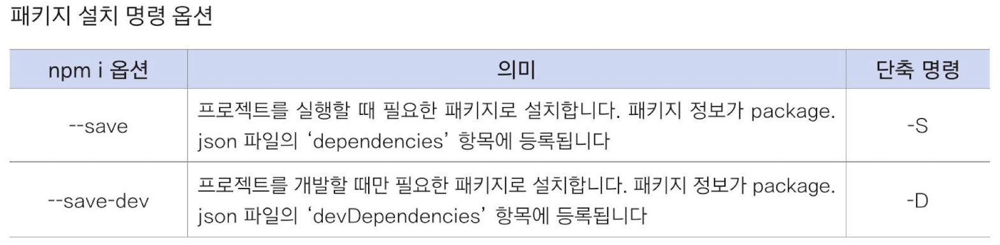
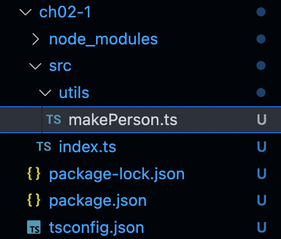

`모든 출처는 do it! 타입스크립트 프로그래밍에 있습니다.`

# CH 02. 타입스크립트 프로젝트 생성과 관리

## 02-1. 타입스크립트 프로젝트 만들기
- node.js 프로젝트 만든 다음, 개발 언어를 타입스크립트로 설정하는 방식
  
  - node.js 프로젝트는 package.json이란 이름의 파일을 만드는 것으로 시작
  - package.json은 터미널에서 `npm init`이란 명령어로 실행하여 생성
  
  ```bash
  mkdir ch02-1
  cd ch02-1
  npm init --y # npm init --yes
  
  {
    "name": "ch02-1",
    "version": "1.0.0",
    "description": "",
    "main": "index.js",
    "scripts": {
      "test": "echo \"Error: no test specified\" && exit 1"
    },
    "keywords": [],
    "author": "",
    "license": "ISC"
  }
  ```
  - package.json은 *node.js가 관리하는 패키지 관리 파일* 로서 프로젝트 정보와 관련 패키지가 기록
  
  - package.json 파일을 만들었으면 프로젝트 구현에 필요한 `오픈소스 패키지`를 `npm install` 또는 간단하게 `npm i` 명령으로 설치 가능
  
    - 다음처럼 두 가지 옵션을 줄 수 있음
  
      
  
  - 터미널에서 다음 명령으로 두 패키지를 -D 옵션으로 설치해 package.json에 등록
    `npm i -D typescript ts-node`
  
  - @types/node 패키지 설치 `npm i -D @types/node`

### 1. 프로젝트 이용자 관점에서 패키지 설치하기
프로젝트를 만들면서 패키지를 설치하면 프로젝트 디렉터리 아래에 node_modules라는 디렉터리가 생기고 여기에 해당 패키지가 설치됨
여러 패키지 설치 -> node_modules 디렉터리 크기가 매우 커짐
- 다른 사람에게 프로젝트를 전달할 때에는 node_modules 디렉토리를 모두 지움
- 다른 사람이 작성한 프로젝트를 전달받을 때에는 가장 먼저 package.json 파일이 있는 디렉터리에서 `npm i` 명령어 실행 -> 그러면 package.json에 등록된 패키지들이 node_modules 디렉터리에 자동으로 설치됨


### 2. tsconfig.json 파일 만들기
- 타입스크립트 프로젝트에서 타입스크립트 컴파일러 설정 파일인 tsconfig.json 파일 필요
- `tsc --init` 명령어

```typescript
// tsconfig.json 파일 수정
{
  "compilerOptions" : {
    "module" : "commonjs",
    "esModuleInterop": true,
    "target": "es5",
    "moduleResolution": "node",
    "outDir": "dist",
    "baseUrl": ".", 
    "sourceMap": true,
    "downlevelIteration": true,
    "noImplicitAny": false, 
    "paths": {"*":["node_modules/*"]}
  },
  "include" : ["src/**/*"]
}
```

### 3. src 디렉터리와 소스 파일 만들기
`"include" : ["src/**/*"]` : ./src와 ./src/utils 디렉터리에 이 프로젝트의 모든 타입스크립트 소스 파일이 있다는 뜻

- tsconfig.json 설정대로 프로젝트를 구성하고자 다음 명령으로 src/utils 디렉터리 생성 : `mkdir -p src/utils`
- 각 디렉터리에 실습하는 데 필요한 소스 파일 생성 : `touch src/index.ts src/utils/makePerson.ts`
- 현재 디렉터리 상태

	


#### - makePerson.ts 작성

```typescript
export function makePerson(name: string, age:number){
    return {name: name, age: age}
}

export function testMakePerson(){
    console.log(
        makePerson('Jane',22),
        makePerson('Jack',33)
    )
}
```


#### - index.ts 작성

```typescript
import { testMakePerson } from "./utils/makePerson";
testMakePerson()
```


### 4. package.json 수정

- Ts 프로젝트를 개발할 때는 ts-node를 사용하지만, 막상 개발이 완료되면 ts 소스코드를 ES5 자바스크립트 코드로 변환해 node로 실행해야 함
- 이를 위해 package.json 파일을 열고 scripts 항목에 dev와 build 명령 추가
  - dev : 개발 중에 src 디렉터리에 있는 index.ts 파일을실행하는 용도
  - build : 개발 완료 후 프로그램 배포하기 위해 dist 디렉터리에 ES5 자바스크립트 파일을 만들때 사용
```typescript
"scripts": {
    "dev" : "ts-node src",
    "build" : "tsc && node dist"
  },
```

```bash
npm run dev

> ch02-1@1.0.0 dev
> ts-node src

{ name: 'Jane', age: 22 } { name: 'Jack', age: 33 }
```

```bash
npm run build

> ch02-1@1.0.0 build
> tsc && node dist

{ name: 'Jane', age: 22 } { name: 'Jack', age: 33 }
```

- npm run 명령을 통해 index.ts 와 makePerson.ts이 모두 정상적으로 ES5 자바스크립트 파일로 컴파일 됨


## 02-2. 모듈 이해하기

- 모듈(module) : index.ts 와 같은 소스코드 (index.ts|makePerson.ts -> 모듈 2개) 
- 소스 파일 하나로 구현해도 되지만, 코드관리&유지/보수를 편리하게 하기 위해 => 모듈화(modulization)
- 소스코드를 여러 개 모듈로 분할하면 어떤 모듈에 어떤 내용이 있는지 서로 알게 해줘야 함
  - export : 기능을 제공하는 쪽에서 사용하는 키워드
  - import : 다른 모듈의 기능을 이용하는 쪽에서 사용하는 키워드


### 모듈화하기

#### 1. 프로젝트 생성 및 설정

```bash
mkdir ch02-2
cd ch02-2
npm init --y # npm init --yes

npm i -D typescript ts-node
npm i -D @types/node

tsc --init

mkdir -p src/utils
touch src/index.ts src/utils/makePerson.ts
```


#### 2. 모듈화 전 (index.ts)

##### - index.ts 작성

```typescript
let MAX_AGE = 100

interface IPerson{
    name : string
    age : number
}

class Person implements IPerson{
    constructor(public name:string, public age:number){}
}

function makeRandomNumber(max: number = MAX_AGE) : number{
    return Math.ceil((Math.random() * max))
}

const makePerson = (name: string, age:number = makeRandomNumber()) => ({name,age})

const testMakePerson = () : void =>{
    let jane: IPerson = makePerson('Jane')
    let jack: IPerson = makePerson('Jack')
    console.log(jane,jack)
}

testMakePerson()
```


##### - 실행

```bash
npm run dev

> ch02-2@1.0.0 dev
> ts-node src

{ name: 'Jane', age: 61 } { name: 'Jack', age: 1 }
```


#### 3. 모듈화 후 (index.ts, Person.ts)

##### - index.ts 작성

```typescript
const testMakePerson = () : void =>{
    let jane: IPerson = makePerson('Jane')
    let jack: IPerson = makePerson('Jack')
    console.log(jane,jack)
}

testMakePerson()
```


##### - Person.ts 작성

```typescript
let MAX_AGE = 100

interface IPerson{
    name : string
    age : number
}

class Person implements IPerson{
    constructor(public name:string, public age:number){}
}

function makeRandomNumber(max: number = MAX_AGE) : number{
    return Math.ceil((Math.random() * max))
}

const makePerson = (name: string, age:number = makeRandomNumber()) => ({name,age})
```


##### - 실행 => 오류 발생

```bash
npm run dev

src/index.ts:2:15 - error TS2304: Cannot find name 'IPerson'.

2     let jane: IPerson = makePerson('Jane')
                ~~~~~~~
src/index.ts:2:25 - error TS2304: Cannot find name 'makePerson'.

2     let jane: IPerson = makePerson('Jane')
                          ~~~~~~~~~~
src/index.ts:3:15 - error TS2304: Cannot find name 'IPerson'.

3     let jack: IPerson = makePerson('Jack')
                ~~~~~~~
src/index.ts:3:25 - error TS2304: Cannot find name 'makePerson'.

3     let jack: IPerson = makePerson('Jack')
```

- 타입스크립트 컴파일러가 IPerson과 makePerson이라는 심벌의 의미를 알 수 없어서 발생
- 타입스크립트의 `export`와 `import` 구문을 통해 해결

##### - export 키워드

- index.ts파일이 동작하려면 Person.ts 파일에 선언한 IPerson과 makePerson이라는 심벌의 의미를 index.ts에 전달해야 함
- Person.ts 파일을 열고 Iperson과 makePerson 선언부에 export 키워드 추가
  - Function, interface, class, type, let, const 키워드 앞에 추가 가능

```typescript
// ch02-2/src/person/Person.ts
export interface IPerson{
    name : string
    age : number
}

// 생략...

export const makePerson = (name: string, age:number = makeRandomNumber()) => ({name,age})
```


##### - import 키워드

- import 키워드 사용하는 형식는 몇 가지가 있지만, 가장 기본적인 형태는 다음과 같음

​	`import { 심벌 목록 } from '파일의 상대 경로'`

- 타입스크립트 파일을 import할 때는 보통 확장자 .ts를 생략함

```typescript
// ch02-2/src/index.ts
import {IPerson, makePerson} from './person/Person'

const testMakePerson = () : void =>{
    let jane: IPerson = makePerson('Jane')
    let jack: IPerson = makePerson('Jack')
    console.log(jane,jack)
}

testMakePerson()
```


- Import * as 구문 : `import * as { 심벌 } from '파일의 상대 경로'`	

  - makeRandomNumber.ts 파일 생성

  ```bash
  touch src/utils/makeRandomNumber.ts
  ```

  ```typescript
  // ch02-2/src/utils/makeRandomNumber.ts
  let MAX_AGE = 100
  
  export function makeRandomNumber(max: number = MAX_AGE) : number{
      return Math.ceil((Math.random() * max))
  }
  ```

  

  - Person.ts 파일 수정

  ```typescript
  // ch02-2/src/person/Person.ts
  import * as U from '../utils/makeRandomNumber'
  
  export interface IPerson{
      name : string
      age : number
  }
  
  class Person implements IPerson{
      constructor(public name:string, public age:number){}
  }
  
  export const makePerson = (name: string, age:number = U.makeRandomNumber()) => ({name,age})
  
  ```

  

- export default 키워드

  - 자바스크립트 호환하기 위한 구문
  - 한 모듈이 내보내는 기능 중 오직 한 개에만 붙일 수 있음
  - import 문으로 불러올 때 중괄호 {} 없이 사용할 수 있음
  - export 등이 있는 파일에서도 사용할 수 있음

  

  - person 디렉터리에 IPerson.ts 파일 생성

  ```bash
  touch src/person/IPerson.ts
  ```

  ```typescript
  // ch02-2/src/person/IPerson.ts
  export default interface IPerson{
      name: string
      age: number
  }
  ```

  

  - person.ts 파일 수정

  ```typescript
  // ch02-2/src/person/Person.ts
  import {makeRandomNumber} from '../utils/makeRandomNumber'
  import IPerson from './IPerson'
  
  
  export default class Person implements IPerson{
      constructor(public name:string, public age:number = makeRandomNumber()){}
  }
  
  export const makePerson = (name: string, age:number = makeRandomNumber()) : IPerson => ({name,age})
  ```
  
  
  
  
    - index.ts 파일 수정
  
  ```typescript
  // ch02-2/src/index.ts 
  import IPerson from './person/IPerson'
  import Person , {makePerson} from './person/Person'
  // Person => export default로 불러왔기에 중괄호 필요 없음
  // makePerson => export로 불러옴
  
  
  const testMakePerson = () : void =>{
      let jane: IPerson = makePerson('Jane')
      let jack: IPerson = new Person('Jack')
      console.log(jane,jack)
  }
  
  testMakePerson()
  ```


- 외부 패키지를 사용할 때 import 문

  - chance와 ramda 패키지 설치
    - Chance : 가짜 데이터(fake data) 생성
    - Ramda : 함수형 유틸리티 패키지 (9장)
  ```bash
  npm i -S chance ramda
  npm i -D @types/chance @types/ramda
  ```

  


  - Package.json 파일 변경됨

  ```typescript
    // -D 옵션으로 설치한 패키지들
  	"devDependencies": {
      "@types/chance": "^1.1.3",
      "@types/node": "^17.0.38",
      "@types/ramda": "^0.28.13",
      "ts-node": "^10.8.0",
      "typescript": "^4.7.2"
    },
    
    // -S 옵션으로 설치한 패키지들
    "dependencies": {
      "chance": "^1.1.8",
      "ramda": "^0.28.0"
    }
  ```

  

  - index.ts 파일 수정

  ```typescript
  import IPerson from './person/IPerson'
  
  import Person , {makePerson} from './person/Person'
  // Person => export default로 불러왔기에 중괄호 필요 없음
  // makePerson => export로 불러옴
  
  import Chance from 'chance' // chance 패키지는 Chance 클래스 하나만 export default 형태로 제공
  import * as R from 'ramda'
  // chance, ramda 둘 다 외부 패키지이므로 node_modules 디렉터리에 있음 => './' 생략
  
  const chance = new Chance()
  let persons: IPerson[] = R.range(0,2).map((n:number) => new Person(chance.name(), chance.age()))
  console.log(persons)
  
  const testMakePerson = () : void =>{
      let jane: IPerson = makePerson('Jane')
      let jack: IPerson = new Person('Jack')
      console.log(jane,jack)
  }
  
  testMakePerson()
  ```

  

  - 실행

  ```bash
  npm run dev
  npm run build
  ```

  


## 02-3. tsconfig.json 파일 살펴보기

```bash
tsc --help
```


- tsconfig.json 파일 살펴보기
  - compilerOptions : tsp 명령 형식에서 옵션을 나타냄
  
  - include : 대상 파일 목록
    
    `'src/**/*'` : src 디렉터리는 물론 src의 하위 디렉터리에 있는 모든 파일을 컴파일 대상으로 포함한다는 의미


```typescript
{
  "compilerOptions" : {
    "module" : "commonjs",
    "esModuleInterop": true,
    "target": "es5",
    "moduleResolution": "node",
    "outDir": "dist",
    "baseUrl": ".", 
    "sourceMap": true,
    "downlevelIteration": true,
    "noImplicitAny": false, 
    "paths": {"*":["node_modules/*"]}
  },
  "include" : ["src/**/*"]
}
```


### 1. module 키

- ts 소스코드 컴파일 -> ES5 js 코드는 웹브라우저/node.js 양쪽에서 모두 동작해야 함
  - 자바스크립트 모듈 
    - 웹 브라우저 동작 : AMD(asynchronous module definition) 방식 -  `amd`
    - node.js (웹 브라우저 x) 동작 : CommonJS 방식 - `commonjs`


### 2. moduleResolution 키

- module : 'commonjs' -> `node`
- module: 'amd' -> `classic`


### 3. target 키

- 트랜스파일할 대상 자바스크립트의 버전 설정
  - 대부분 `es5` 설정
  - 최신 버전의 node.js 사용 -> `es6`


### 4. baseUrl과 ourDir 키

- 트랜스파일된 ES5 자바스크립트 파일을 저장하는 디렉터리 설정

  - tsc는 tsconfig.json 파일이 있는 디렉터리에서 실행

  

  - baseUrl : `'.'` (현재 디렉터리)
  - OutDir : baseUrl 설정값을 기준으로 했을 때 하위 디렉터리의 이름
    - `'dist'` 으로 설정했으므로 빌드된 결과가 dist 디렉터리에 만들어짐


### 5. paths 키

- 소스 파일의 import 문에서 from 부분을 해석할 때 찾아야 하는 디렉터리를 설정
- import 문이 찾아야 하는 소스가 외부 패키지이면 node_modules 디렉터리에서 찾아야하므로 키 값에 `["node_modules/*"]` 추가


### 6. esModuleInterop 키

- 웹 브라우저에서 동작한다는 가정으로 CommonJS 방식에 혼란을 줄 수 있음
  - `chance` 패키지가 대표적인 예시 : 동작하게 하려면 `true`


### 7. sourceMap 키

- `true` : 트랜스파일 디렉터리에 .js 이외에도 .js.map 파일이 만들어짐
  - .js.map 파일 
    - 자바스크립트 코드가 타입스크립트 코드의 어디에 해당하는지를 알려줌
    - 주로 디버깅할 때 사용됨


### 8. downlevelIteration 키

- `true` :  생성기(generator) 구문이 정상적으로 동작하려면


### 9. noImplicitAny 키

- `False` : 타입을 지정하지 않더라도 문제로 인식하지 않음
