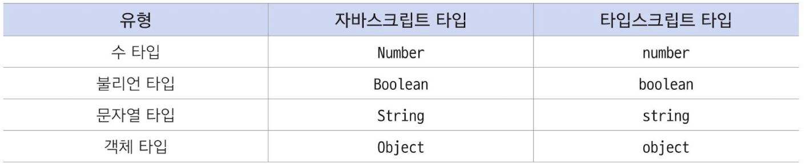
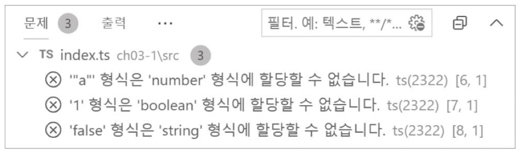
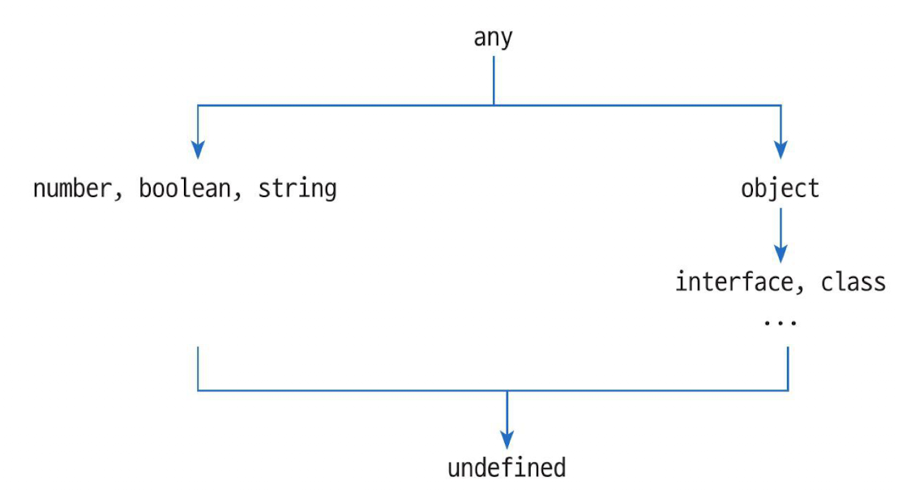

`모든 출처는 do it! 타입스크립트 프로그래밍에 있습니다.`

# CH 03. 객체와 타입
## 03-1. 타입스크립트 변수 선언문

### 1. 타입스크립트 기본 제공 타입




### 2. let과 const 키워드

- let 선언 변수 : 코드에서 변숫값이 수시로 변경될 수 있음 암시

  ```typescript
  let 변수 이름[= 초깃값]
  ```

  

- const 선언 변수 : 코드에서 변숫값이 절대 변하지 않는다는 것을 암시

  ```typescript
  const 변수 이름 = 초깃값
  ```

  

### 3. 타입 주석

- 변수 선언문을 확장해 다음과 같은 형태로 타입 명시

  ```typescript
  let 변수 이름: 타입 [=초깃값]
  const 변수 이름: 타입 = 초깃값
  ```

- 변수 선언 예시

  ```typescript
  let n: number = 1
  let b: boolean = true
  let s: string = 'hello'
  let o: object = {}
  ```

  - 타입 주석으로 명시한 타입에 해당하는 값으로만 바꿀 수 있음 (자동형변환 x)
  - 타입 불일치 오류 발생 예시

  ```typescript
  let n: number = 1
  let b: boolean = true
  let s: string = 'hello'
  let o: object = {}
  
  n = 'a' // 타입 불일치 오류 발생
  b = 1 // 타입 불일치 오류 발생
  s = false // 타입 불일치 오류 발생
  o = {name:'Jack', age:32}
  ```

  


### 4. 타입 추론(type inference)

- 타입 주석 부분을 생략할 수 있음

- 타입 추론(type inference) : 대입 연산자 = 오른쪽 값에 따라 변수의 타입을 지정

- 타입 추론 예시

  ```typescript
  let n = 1       // n의 타입을 number로 판단
  let b = true    // b의 타입을 boolean으로 판단
  let s = 'hello' // s의 타입을 string으로 판단
  let o = {}      // o의 타입을 object로 판단
  ```

  

### 5. any 타입

- 자바스크립트와의 호환성

- any 타입 예시

  ```typescript
  let a: any = 0;
  a = 'hello'
  a = true
  a = {}
  ```


### 6. undefined 타입

- 자바스크립트에서 undefined는 `값`임. 변수를 초기화하지 않으면 해당 변수는 undefined 값을 가짐

- 타입스크립트에서 undefined는 `타입`이기도하고 `값`이기도 함

- undefined 타입 예시

  ```typescript
  let u: undefined = undefined
  u = 1 // Type '1' us not assignable to type 'undefined' 오류 발생
  // undefined 타입으로 선언되었으므로 오직 undefined값만 가질 수 있음
  // undefined의 상위 타입인 number 타입 1을 저장하려고 했기에 오류 발생
  ```


- 타입 계층도

  - any는 모든 타입의 루트 타입, 즉 최상위 타입
  - undefined는 모든 타입의 최하위 타입

  

### 7. 템플릿 문자열

- 템플릿 문자열(template string) : 변수에 담긴 값을 조합해 문자열을 만들 수 있게 함

- 역따옴표(backtick) `로 문자열을 감싸고, 변수를 ${} 기호로 감싸는 형태로 만들 수 있음

  ```typescript
  `${변수 이름}`
  ```


- 템플릿 문자열 예시

  ```typescript
  let count = 10, message = 'Your count'
  let result = `${message} is ${count}` // count와 message 변수에 담긴 값은 템플릿 문자열에서 문자열로 치환
  console.log(result) // Your count is 10
  ```


## 03-2. 객체와 인터페이스

- `object` 타입 : `인터페이스`, `클래스`의 상위 타입

  - number, boolean, string 타입의 값을 가질 수 없음

  - 하지만 속성 이름이 다른 객체를 모두 자유롭게 담을 수 있음

    ```typescript
    let o : object = {name:'Jack', age:32}
    o = {first: 1, second: 2} // 오류 발생 - name,age 속성으로 구성된 객체만 가질 수 있음
    ```

  - 객체를 대상으로 하는 any 타입처럼 동작


### 1. 인터페이스 선언문

- `interface` : 객체의 타입을 정의할 수 있게 함

  - 객체를 의미하는 중괄호 {} 로 속성의 이름과 타입을 나열하는 형태

    ```typescript
    interface 인터페이스 이름 {
    	속성 이름[?] : 속성 타입[,...]
    }
    ```
    
  - **interface 구문 예시**
  
    ```typescript
    // IPerson.ts
    interface IPerson {
      name : string
      age : number
    }
    ```
  
    - 여러 줄로 구현할 때는 `쉼표(,)` 대신 `세미콜론(;)`을 구분자로 쓰거나 `줄바꿈`만 해도 됨
  
  - **interface 구문 예시**
  
    ```typescript
    interface IPerson {
      name : string
      age : number
    }
    let good : IPerson = {name: 'Jack', age: 32}
    
    let bad1 : IPerson = {name: 'Jack'} // age 속성이 없으므로 오류
    let bad2 : IPerson = {age: 32}      // name 속성이 없으므로 오류
    let bad3 : IPerson = {}             // name과 age 속성이 없으므로 오류
    let bad4 : IPerson = {name: 'Jack', age: 32, etc: true} // etc 속성이 있어서 오류


### 2. 선택 속성 구문

- 선택 속성(optional property) : 인터페이스를 설계할 때 어떤 속성은 있어도 되고 없어도 되는 형태로 만듦

  ```typescript
  interface IPerson2 {
    name: string  // 필수 속성
    age: number   // 필수 속성
    etc?: boolean // 선택 속성
  }
  let good1 : IPerson2 = {name: 'Jack', age: 32}
  let good2 : IPerson2 = {name: 'Jack', age: 32, etc: true}
  ```

  

### 3. 익명 인터페이스

- 익명 인터페이스(anonymous interface) : interface 키워드도 사용하지 않고 인터페이스의 이름도 없는 인터페이스

  - **익명 인터페이스 예시**

    ```typescript
    let ai : {
      name: string
      age: number
      etc?: boolean 
    } = {name: 'Jack', age:32}
    ```

  - **함수에 사용된 익명 인터페이스 예시**

    ```typescript
    function printMe(me: {name:string, age:number, etc?: boolean}){
      console.log(
        me.etc ?
        `${me.name} ${me.age} ${me.etc}`:
        `${me.name} ${me.age}`
      )
    }
    printMe(ai) // Jack 32
    ```

    

## 03-3. 객체와 클래스

### 1. 클래스 선언문

- class, private, public, protected, implements, extend 와 같은 키워드 제공

  ```typescript
  class 클래스 이름{
    [private | protected | public] 속성 이름[?]: 속성 타입[...]
  }
  ```


- name과 age라는 속성을 가진 클래스 선언

  ```typescript
  //Person1.ts
  class Person1{
    name: string
    age?: number
  }
  ```

  

- Person1 클래스에 new 연산자를 적용해 jack1이라는 이름의 Person1 타입 변수

  ```typescript
  //Person1.ts
  class Person1{
    name: string
    age?: number
  }
  let jack1 : Person1 = new Person1() // Person1 타입 변수 생성
  jack1.name = 'Jack'; jack1.age = 32
  console.log(jack1) // Person1 { name:'Jack', age: 32 }


### 2. 접근 제한자(access modifier)

- 클래스의 속성 `public`, `private`, `protect`와 같은 접근 제한자를 이름 앞에 붙일 수 있음 (생략하면 public)

  

### 3. 생성자(constructor)

- 생성자 : 타입스크립트 클래스는 `constructor`라는 이름의 특별한 메서드 포함

- 타입스크립트 클래스는 클래스의 속성(name,age)을 선언할 수 있음

  - public같은 접근 제한자를 붙이면 

    해당 매개변수의 이름을 가진 속성이 클래스에 선언된 것처럼 동작합니다. 

  ```typescript
  // Person2.ts (Person1.ts와 똑같이 동작)
  class Person2{
    constructor(public name: string, public age?: number){}
  }
  let jack2 : Person2 = new Person2('Jack',32)
  console.log(jack2) // Person2 { name:'Jack', age: 32 }
  ```

  ```typescript
  // Person3.ts (Person2.ts와 똑같이 동작)
  class Person3 {
    name: string
    age?: number
    constuctor(name: string, age?: number){
      this.name = name; this.age = age
    }
  }
  let jack3 : Person3 = new Person3('Jack',32)
  console.log(jack3) // Person3 { name:'Jack', age:32 }
  ```


### 4. 인터페이스 구현

- 다른 객체지향 언어와 마찬가지로 타입스크립트 클래스는 `인터페이스`를 구현할 수 있음

- `implements` 키워드

  ```typescript
  class 클래스 이름 implements 인터페이스 이름 {
    ...
  }
  ```


- IPerson4 라는 이름의 인터페이스를 구현하는 예

  - 주의할 점) 인터페이스는 이러한 속성이 있어야 한다는 규약(spec)에 불과할 뿐 물리적으로 해당 속성을 만들지 않음

  - 따라서 클래스 몸통에는 **반드시 인터페이스가 정의하고 있는 속성을 멤버 속성으로 포함해야 함**

  - **인터페이스 구현 예시**

    ```typescript
    interface IPerson4{
      name: string
      age?: number
    }
    
    class Person4 implements IPerson4{
      name: string
      age: number
    }
    ```
    
    
    
  - **인터페이스 구현 예시**
  
    ```typescript
    interface IPerson4{
      name:string
      age?: number
    }
    
    class Person4 implements IPerson4{
      constuctor(public name: string, public age?: number){}
    }
    
    let jack4 : IPerson4 = new Person4('Jack',32)
    console.log(jack4) // Person4 { name:'Jack', age:32 }
    ```
  
    

### 5. 추상 클래스

- `abstract` 키워드 : 추상 클래스 생성 키워드

  - abstract 키워드를 class 키워드 앞에 붙여서 만듦

  - 추상 클래스 : 자신의 속성이나 메서드 앞에 abstract를 붙여 나를 상속하는 다른 클래스에서 이 속성이나 메서드를 구현하게 함 

    ```typescript
    abstract class 클래스 이름 {
      abstract 속성 이름 : 속성 타입
      abstract 메서드 이름(){}
    }
    ```

    

  - **추상 클래스 예시**

    - name 속성 앞에 abstract가 붙었으므로 new 연산자를 적용해 객체를 만들 수 없음

    ```typescript
    abstract class AbstractPerson5{
      abstract name: string
      constructor(public age?: number){}
    }
    ```

  

### 6. 클래스의 상속

- `extends` 키워드 : 상속 클래스 생성

  ```typescript
  class 상속 클래스 extends 부모 클래스 { ... }
  ```

  

- Person5 클래스는 AbstractPerson5 추상 클래스를 상속해 AbstractPerson5가 구현한 age 얻음

  AbstractPerson5를 상속받는 클래스가 구현해야 할 name 속성 구현

  부모 클래스의 생성자를 super 키워드로 호출할 수 있음

  ```typescript
  // Person5.ts
  abstract class AbstractPerson5{
    abstract name: string
    constructor(public age?: number){}
  }
  
  class Person5 extends AbstarctPerson5 {
    constructor(public name: string, age?: number){
      super(age)
    }
  }
  
  let jack5 : Person5 = new Person5('Jack',32)
  console.log(jack5) // Person5 { name:'Jack', age:32 }
  ```

  

### 7. static 속성

- 타입스크립트 클래스는 정적인 속성

  ```typescript
  class 클래스 이름 {
    static 정적 속성 이름 : 속성 타입
  }
  ```


- **static 속성 예시**

  - '클래스 이름.정적 속성 이름' : `점 표기법(dot notation)`을 사용해 값을 얻거나 설정

  ```typescript
  class A{ // 클래스 A는 initValue라는 정적 속성
    static initValue = 1
  }
  
  let initVal = A.initValue // 1
  ```

  

## 03-4. 객체의 비구조화 할당문

- **구조화가 필요한 코드 예시**

  - personName, companyName : name, age

  ```typescript
  let personName = 'Jack'
  let personAge = 32
  
  let companyName = 'Apple Company, Inc'
  let companyAge = 43
  ```

  

- `구조화(structuring)` : 인터페이스나 클래스를 사용해 관련된 정보를 묶어 새로운 타입으로 표현

  ```typescript
  // IPerson_ICompany.ts
  export interface IPerson {
    name : string
    age : number
  }
  
  export interface ICompany {
    name : string
    age : number
  }
  ```


```typescript
import {IPerson, ICompany} from './IPerson_ICompany'

let jack: IPerson = {name:'Jack', age:32},
    jane: IPerson = {name:'jane', age:32}

let apple : ICompany = {name: 'Apple Company, Inc', age:43},
    ms : ICompany = {name: 'Microsoft', age: 44}
```


### 1. 비구조화(destructuring)란? 

- 비구조화(destructuring) : 구조화된 데이터를 분해하는 것

  - 구조화된 jack 변수에서 jack이 아닌 jack.name, jack.age 부분을 각각 name과 age 변수에 저장
  - 이 시점부터는 jack 변수는 더 사용하지 않고 그대신 name과 age 변수만 사용

  ```typescript
  let name = jack.name , age = jack.age
  ```


### 2. 비구조화 할당(destructuring)

- 객체와 더불어 `배열`, `튜플`에도 적용할 수 있음

- 객체에 적용하려면 얻고 싶은 속성을 중괄호로 묶음

  - 비구조화 할당 : name과 age 변수가 새롭게 만들어지고

    name변수는 jack.name의 값

    age변수는 jack.age의 값을 각각 초깃값으로 할당받기 때문

  ```typescript
  let {name,age} = jack
  ```

  ```typescript
  import {IPerson} from './IPerson_ICompany'
  
  let jack: IPerson = {name: 'Jack', age: 32}
  let {name, age} = jack
  console.log(name,age) // Jack 32
  ```

 

### 3. 잔여 연산자| 전개 연산자

- 잔여 연산자, 전개 연산자 : `... 연산자` 사용하는 위치에 따라 다르게 부름

  

#### a. 잔여 연산자(rest operator)

```typescript
// rest.ts
let address: any={
  country: 'Korea',
  city: 'Seoul',
  address1 : 'Gangnam-gu',
  address2 : 'Sinsa-dong 123-456',
  address3 : '789 street, 2 Floor ABC building'
}
const {country, city, ...detail} = address
console.log(detail)
// { address1 : 'Gangnam-gu',
//   address2 : 'Sinsa-dong 123-456',
//   address3 : '789 street, 2 Floor ABC building' }
```


#### b. 전개 연산자(spread operator)

```typescript
let coord = {...{x:0}, ...{y:0}}
console.log(coord) // {x:0, y:0}
```

- `... 연산자`가 비구조화 할당문이 아닌 곳에서 사용될 때
- 객체의 속성을 모두 **전개**해 새로운 객체로 만들어 줌


```typescript
// spread.ts
let part1 = {name:'jane'}, part2 = {age:22}, part3 = {city:'Seoul', country: 'Kr'};
let marged = {...part1, ...part2, ...part3}
console.log(merged)

// {name:'jane', age:22, city: 'Seoul', country:'Kr'}
```


## 03-5. 객체의 타입 변환

- 타입 변환(type conversion) :타입이 있는 언어들은 특정 타입의 변숫값을 다른 타입의 값으로 변환할 수 있는 기능 제공

  - object 타입에 name 속성이 없어서 **오류 발생**

    ```typescript
    let person: object = {name: 'Jack', age: 32};
    person.name // 오류 발생 - 'object' 형식에 'name' 속성이 없습니다
    ```

  - **오류 해결**

    ```typescript
    let person: object = {name: 'Jack', age: 32};
    (<{name: string}>person).name // {name: string} 타입으로 변환해 person.name 속성값을 얻게 함
    ```

    

#### 1. 타입 단언 (type assertion)

- 형태 2가지

```typescript
// 형태 1
(<타입>객체)

// 형태2
(객체 as 타입)
```


- ES5 자바스크립트 구문이 아님. 따라서 javascript의 타입 변환 구문과 구분하기 위해 `타입 단언`이라는 용어 사용

  ```typescript
  //INameable.ts
  export default interface INameable{
    name:string 
  }
  ```

  ```typescript
  // type-assertion.ts
  import INameable from './INameable'
  let obj: object = {name:'Jack'}
  
  let name1 = (<INameable>obj).name
  let name2 = (obj as INameable).name
  console.log(name1, name2) // Jack Jack
  ```