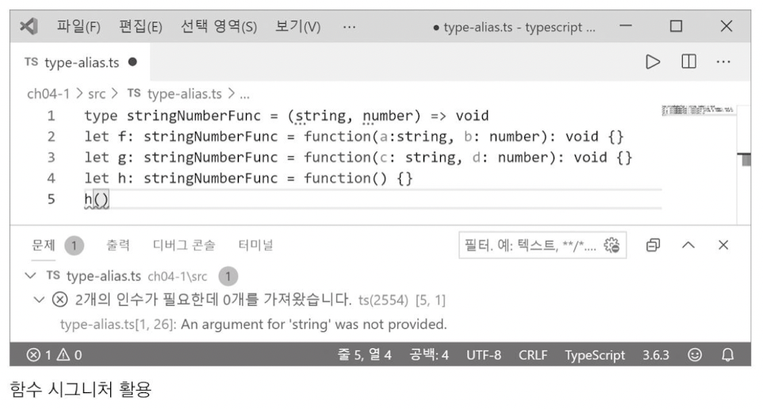

`모든 출처는 do it! 타입스크립트 프로그래밍에 있습니다.`

# CH 04. 함수와 메서드

## 04-1. 함수 선언문

- 함수 선언 방식
  - function 키워드로 만드는 함수
  - => 기호로 만드는 함수 (04-3절)

- **function 키워드**로 만드는 함수

  ```typescript
  function 함수 이름(매개변수1, 매개변수2[,...]){
    함수 몸통
  }
  ```


- 타입스크립트 함수 선언문은 자바스크립트 함수 선언문에서 

  매개변수와 함수 반환값(return type)에 타입 주석을 붙이는 형태로 구성

  ```typescript
  function 함수 이름(매개변수1:타입1, 매개변수2:타입2[,...]) : 반환값 타입 {
    함수 몸통
  }
  ```


- 타입스크립트 함수 선언문 예시

  ```typescript
  function add(a:number, b:number): number {
    return a + b
  }
  ```


### 1. 매개변수와 반환값의 타입 주석 생략
- 변수 때와 마찬가지로 매개변수와 반환값에 대한 타입 주석 생략 가능
  - `추천하지는 않음`. 구현 의도 알기 어렵고 잘못 사용하기에 쉬움


### 2. void 타입

- **값을 반환하지 않는 함수**는 반환 타입이 void

  ```typescript
  function printMe(name: string, age: number) : void {
    console.log('name: ${name}, age: ${age}')
  }
  ```


### 3. 함수 시그니처

- 함수 시그니처(function signature) : 변수에 타입이 있듯이 함수에도 타입이 있음

  ```typescript
  (매개변수1 타입, 매개변수2 타입[,...]) => 반환값 타입
  ```

  - printMe 함수의 시그니처를 이용한 예시
    - string과 number 타입의 매개변수가 두개 있고 반환 타입 void임
    - 따라서 함수 시그니처는 (string, number) => void임

  ```typescript
  let printMe: (string, number) => void = function (name: string, age: number) : void {}
  ```

  - 만약 매개변수가 없으면 단순히 ()로 표현함 

       => void는 매개변수도 없고 반환값도 없는 함수 시그니처임


### 4. type 키워드로 타입 별칭 만들기 

- **타입 별칭(type alias)** : type 키워드는 기존에 존재하는 타입을 단순히 이름만 바꿔서 사용할 수 있게 해줌

  ```typescript
  type 새로운 타입 = 기존 타입
  ```

  - 예시

    ```typescript
    // type-alias.ts
    type stringNumberFunc = (string, number) => void
    // (string, number) => void 함수 시그니처를 stringNumberFunc이라는 이름으로 타입 별칭을 만듦
    let f : stringNumberFunc = function(a: string, b:number): void {}
    let g : stringNumberFunc = function(c: string, d:number): void {}
    ```
    
    함수의 타입 즉, 함수 시그니처를 명시하면 **매개변수의 개수, 타입, 반환 타입이 다른 함수를 선언하는 잘못**을 미연에 방지할 수 있음
    
    

### 5. undefined 관련 주의 사항

- undefined 타입은 타입 계층도에서 모든 타입 중 최하위 타입

  ```javascript
  // undefined를 고려하지 않은 코드 예시
  01: interface INameable{
  02: 	name: string
  03: }
  04: function getName(o: INameable){return o.name} 
  05:
  06: let n = getName(undefined) // 오류 발생
  07: console.log(n)
  ```

  - 04행에서 getName은 INameable 타입의 매개변수를 요구하지만 06행에서 INameable 타입 객체가 아니라 undefined를 매개변수를 호출해도 **구문 오류가 발생하지 않음**. 즉, undefined는 최하위 타입이므로 INameable을 상속하는 자식 타입으로 간주함

  - 하지만 코드를 실행해보면 04행의 o.name부분이 undefined.name이 되어 'Cannot read property 'name' of undefined'이라는 오류 발생! 

  - 이런 오류를 방지하려면 매개변숫값이 undefined인지 판별하는 코드를 작성해야 함.

  

  ```javascript
  // getName 함수의 몸통은 매개변수 o의 값이 undefined일 때를 고려한 예시
  // undefined.ts
  interface INameable {
    name: string
  }
  function getName(o: INameable){
    return o != undefined ? o.name : 'unknown name'
  }
  
  let n = getName(undefined)
  console.log(n)											 // unknown name
  console.log(getName({name: 'Jack'})) // Jack
  ```

  

  ```javascript
  // 인터페이스에 선택 속성이 있을 때
  // optional.ts
  interface IAgeable{
    age?: number
  }
    
  function getAge(o: IAgeable){
    return o != undefined && o.age ? o.age : 0
  }
    
  console.log(getAge(undefined))  // 0
  console.log(getAge(null))				// 0
  console.log(getAge({age:32}))   // 32
  ```

  

### 6. 선택적 매개변수

- 


## 04-2. 함수 표현식

## 04-3. 화살표 함수와 표현식 문

## 04-4. 일등 함수 살펴보기

## 04-5. 함수 구현 기법

## 04-6. 클래스 메서드
